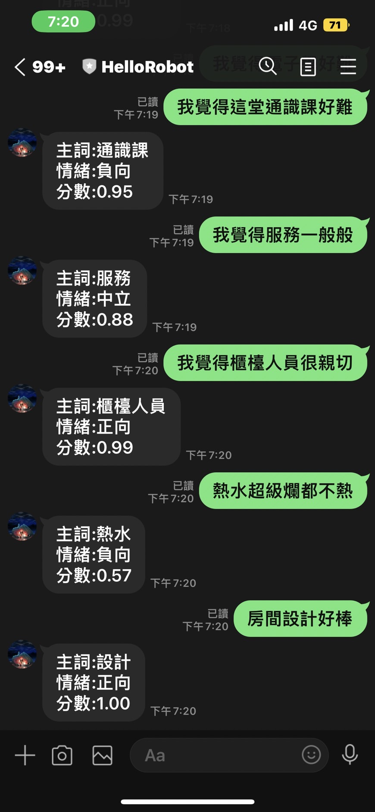

說明：
第一步驟是將老師的程式碼照打下來，會回傳positive, negative, 或neutral

第二步驟新增了下列程式碼

    let result_string = []
    const result_score = results[0].confidenceScores[results[0].sentiment]

    if(results[0].sentiment == "positive"){
        result_string = "正向"
    }
    else if(results[0].sentiment == "negative"){
        result_string = "負向"
    }
    else{
        result_string = "中立"
    }

並將text改成
`
text: 情緒:${result_string}\n分數:${result_score.toFixed(2)}
`

第三步驟先做以下更動去抓到主詞

const results = await analyticsClient.analyzeSentiment(documents, "zh-hant",{
        includeOpinionMining:true
    });

再更動text部分，使得可以回應包含主詞、情緒，以及分數的回覆

text: `主詞:${result_n}\n情緒:${result_string}\n分數:${result_score.toFixed(2)}`

即可完成此次作業

結果：

